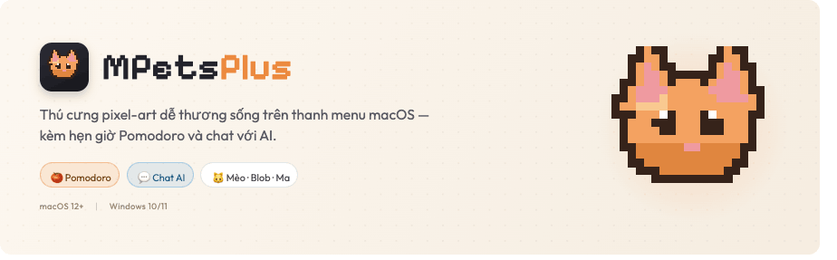
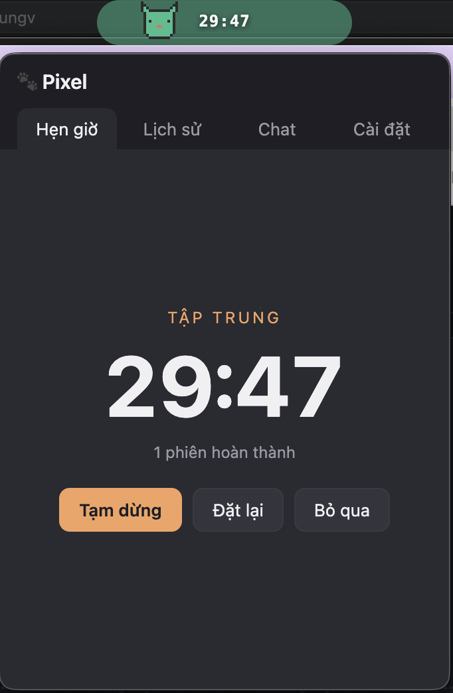
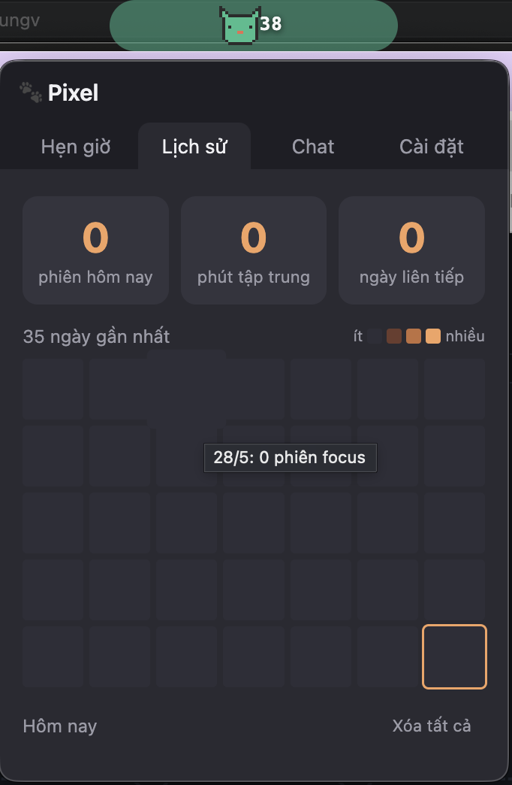
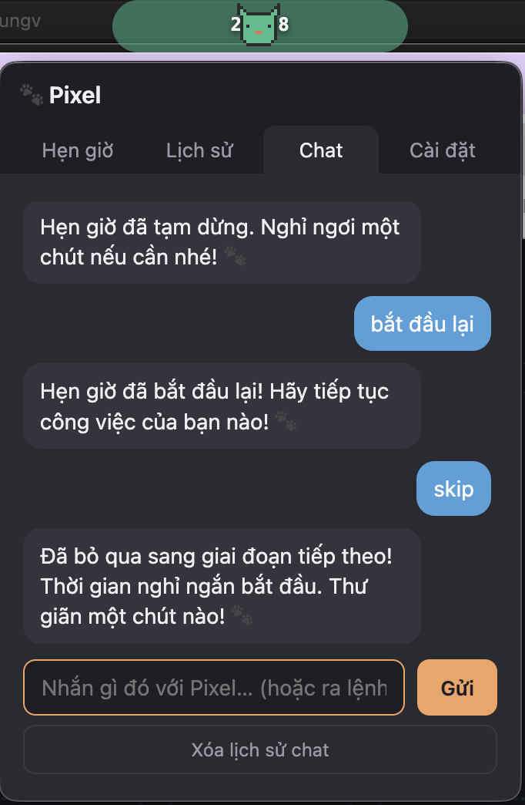
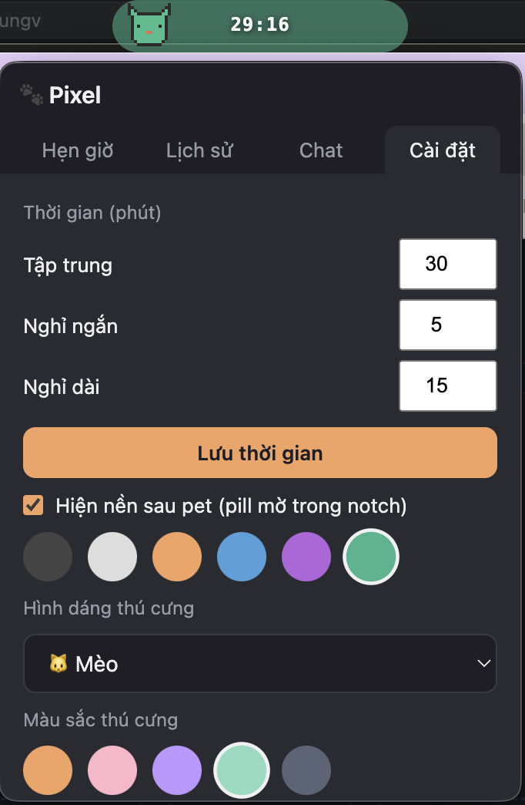
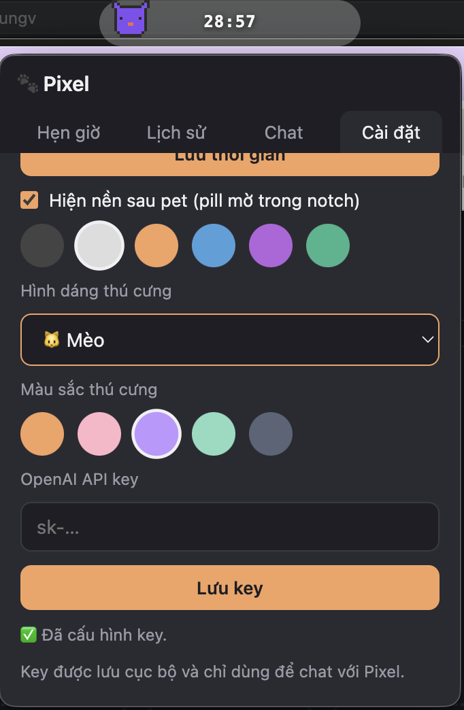

<p align="center">
  <picture>
    <source media="(prefers-color-scheme: dark)" srcset="assets/branding/banner-dark.png">
    
  </picture>
</p>

<p align="center">
  Thú cưng pixel-art dễ thương sống trên thanh menu macOS — cùng với hẹn giờ Pomodoro và chat AI.
</p>

<p align="center">
  
  
</p>

---

## Tải về

👉 **[Tải bản mới nhất](../../releases/latest)**

| Hệ điều hành | File cần tải |
|---|---|
| macOS (Apple Silicon / Intel) | `MPets.Plus-x.x.x-arm64.dmg` |
| Windows 10/11 | `MPets.Plus.Setup.x.x.x.exe` |

---

## Cài đặt trên macOS

**1.** Mở file `.dmg` vừa tải → kéo **MPets Plus** vào thư mục **Applications**

**2.** Lần đầu mở app, macOS có thể hiện thông báo chặn. Làm một trong hai cách:

- Mở **System Settings → Privacy & Security** → kéo xuống → bấm **Open Anyway**
- Hoặc: right-click vào app trong Finder → **Open** → **Open**

> Chỉ cần làm bước này một lần.

**3.** Thú cưng xuất hiện trên thanh menu — **click vào để mở**.

---

## Cài đặt trên Windows

**1.** Chạy file `.exe` vừa tải

**2.** Nếu Windows SmartScreen hiện cảnh báo → bấm **More info → Run anyway**

**3.** Thú cưng xuất hiện ở trên cùng màn hình — **click vào để mở**

---

## Tính năng


**🐾 Thú cưng trên thanh menu**
Di chuyển qua lại, thay đổi cảm xúc theo trạng thái làm việc. Có 3 hình dáng (Mèo / Blob / Ma) và 5 màu sắc để chọn.

**🍅 Hẹn giờ Pomodoro**
25 phút tập trung → nghỉ ngắn → nghỉ dài. Thời gian tuỳ chỉnh được. Thông báo khi chuyển giai đoạn.

**💬 Chat với Pixel**
Nói chuyện hoặc ra lệnh bằng ngôn ngữ tự nhiên: *"bắt đầu hẹn giờ"*, *"đặt 30 phút tập trung"*, *"dừng lại"*. Cần OpenAI API key.

---

## Ảnh chụp màn hình

<table>
  <tr>
    <td align="center" width="33%">
      <br>
      <sub><b>🍅 Hẹn giờ</b><br>Đếm ngược tập trung / nghỉ</sub>
    </td>
    <td align="center" width="33%">
      <br>
      <sub><b>📊 Lịch sử</b><br>Thống kê &amp; chuỗi ngày tập trung</sub>
    </td>
    <td align="center" width="33%">
      <br>
      <sub><b>💬 Chat</b><br>Ra lệnh bằng ngôn ngữ tự nhiên</sub>
    </td>
  </tr>
  <tr>
    <td align="center" width="33%">
      <br>
      <sub><b>⚙️ Cài đặt</b><br>Tuỳ chỉnh thời gian &amp; giao diện</sub>
    </td>
    <td align="center" width="33%">
      <br>
      <sub><b>🐱 Thú cưng</b><br>Đổi hình dáng, màu &amp; API key</sub>
    </td>
    <td width="33%"></td>
  </tr>
</table>

---

## Thiết lập chat (OpenAI API key)

1. Mở popup → tab **Cài đặt**
2. Dán API key vào ô **OpenAI API key** → bấm **Lưu key**

Key được lưu trên máy, không gửi đi đâu ngoài OpenAI.

> Chưa có key? Tạo tại [platform.openai.com/api-keys](https://platform.openai.com/api-keys)

---

## Cập nhật

App tự động kiểm tra bản mới khi khởi động. Khi có cập nhật:
- Thông báo xuất hiện → app tải về tự động
- Hỏi *"Khởi động lại để cài đặt?"* → bấm **Khởi động lại ngay**

---

## Gỡ cài đặt

**macOS:** Kéo MPets Plus từ Applications vào Trash. Để xoá sạch dữ liệu:
```
~/Library/Application Support/MPets Plus
```

**Windows:** Settings → Apps → tìm MPets Plus → Uninstall
